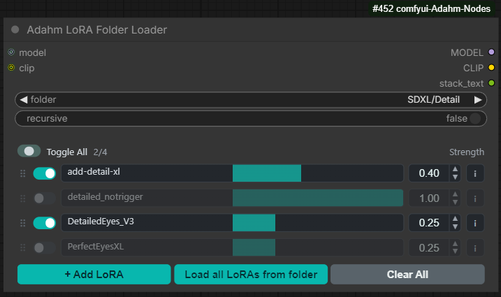
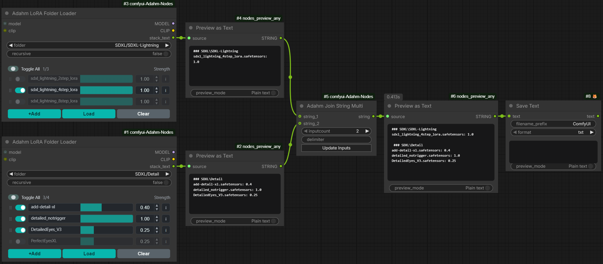
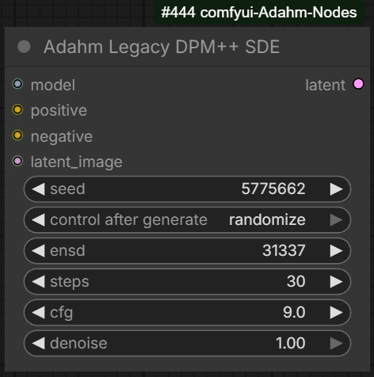
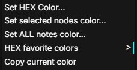
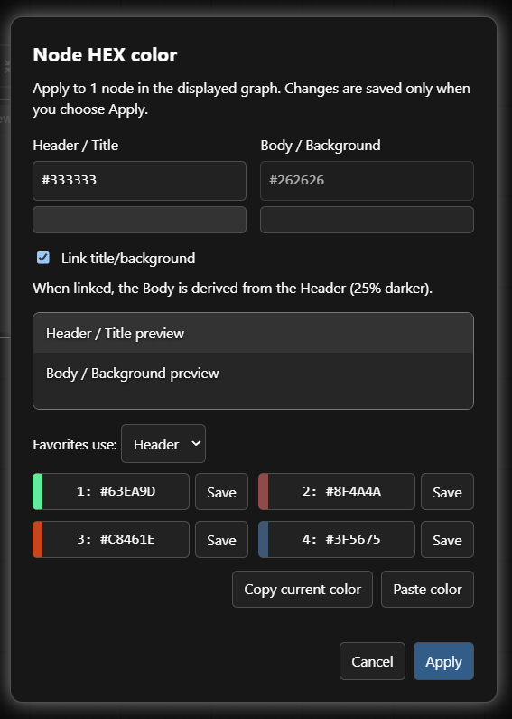
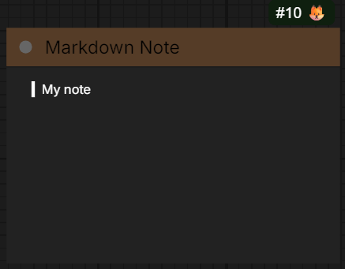
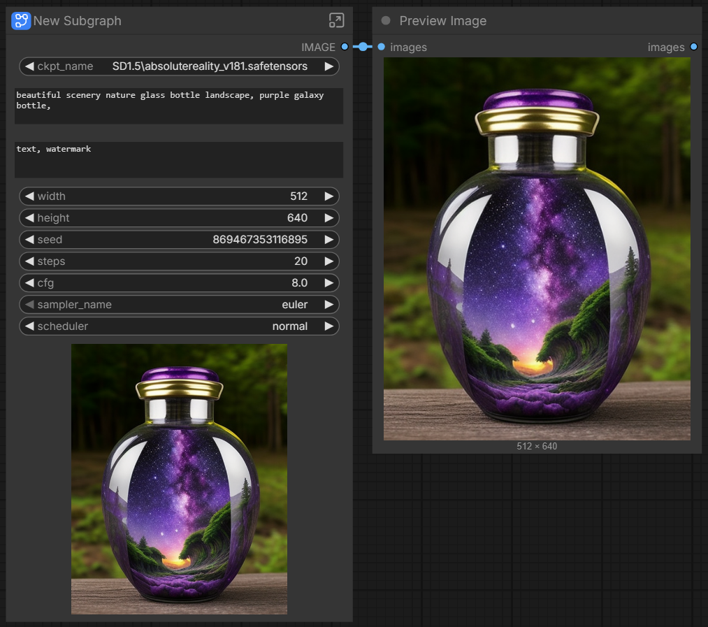
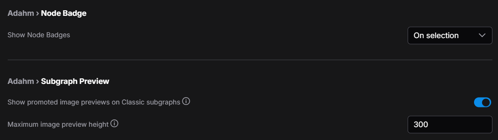

🤗 [HuggingFace](https://huggingface.co/Adahm) |  [CivitAI](https://civitai.com/user/Adahm)


# ComfyUI-Adahm-Nodes

A ComfyUI custom-node pack containing Adahm utility nodes and frontend helpers.

## What's included (Node List)

### Adahm LoRA Folder Loader
---

Created to avoid adding a whole folder of LoRAs one file at a time. It keeps the familiar Power LoRA Loader-style list and adds **Load all LoRAs from folder**, with an option to include subfolders.

Based on the Power LoRA Loader by **rgthree** in [rgthree-comfy](https://github.com/rgthree/rgthree-comfy). This is a separate Adahm node; it does not modify rgthree's original node.



Choose a folder, then load its files together or use **+ Add LoRA** for an individual file. Each row can be switched on or off, reordered, removed, and given its own strength. The node grows and shrinks with the list, so empty space does not need to be resized manually.

Click a row's **i** button to see a local preview, metadata, and trigger words. This is a read-only information window: it does not add trigger words to a prompt. Civitai links use `civitai.red`.

The outputs are `MODEL`, `CLIP`, and `stack_text`. The text output lists enabled LoRAs by folder with their current strengths, making a stack easier to inspect or record. The loader also keeps compatible row data for AusBoss' **Absorb chain LoRAs**.

Example:  


### Adahm Legacy DPM++ SDE
---

Created to help bring older AUTOMATIC1111 image-generation workflows into ComfyUI. A matching seed alone may not reproduce an older image when the noise generation or sampling schedule is different.



This node combines the legacy SDE noise approach, the older Karras schedule, and an `ensd` seed adjustment in one sampler. The `denoise` control supports both a full first pass and a partial second pass for img2img or an upscale workflow.

The original reference is **AUTOMATIC1111**'s
[Stable Diffusion WebUI](https://github.com/AUTOMATIC1111/stable-diffusion-webui).
The underlying DPM++ SDE sampling implementation comes from **Katherine
Crowson (`crowsonkb`)**'s
[k-diffusion](https://github.com/crowsonkb/k-diffusion), used through ComfyUI's sampling API. This is a compatibility node, not a modification of either original project.

Connect the model, positive and negative conditioning, and input latent. The output is a sampled `LATENT`. Use `denoise=1.0` for a full pass and lower it when refining an existing latent. Matching an old image still depends on the checkpoint, VAE, prompts, and other generation settings; an identical result is not guaranteed.

### Adahm Join String Multi
---

Created for prompts assembled from optional parts, where the first text input may be empty or an unused branch may supply no text. Unlike the original node's required first string, every string input here is optional.

Adapted from **Kijai**'s `Join String Multi` in [ComfyUI-KJNodes](https://github.com/kijai/ComfyUI-KJNodes). 
The Adahm version skips empty, missing, or `None` inputs, joins only the text that is present, and returns an empty string when nothing is supplied. This avoids an unwanted leading separator when the first input is empty.

Set `inputcount`, then click **Update Inputs** to add or remove sockets.
The `delimiter` chooses what goes between the populated text inputs.
The original `return_list` option and custom help button are omitted:
this version has one combined `string` output.

Both text nodes use normal ComfyUI caching. They do not deliberately force an unchanged workflow to run again. Upstream changes, seed changes, cleared caches, and execution blockers still follow ComfyUI's normal rules.

### Adahm Clear Previews on Start
---

Clears generated image previews when a workflow execution starts. The node keeps the existing workflow-compatible behavior and exposes an enabled/ disabled switch.


- When __enabled__ - image previews are cleared at the beginning of execution of the workflow  
- When __disabled__ - standard ComfyUI behavior, previews stay until execution is finished, then updated with new image

*I use it in my workflow where I have multiple image preview windows stacked next to each other while testing different samplers or small prompt changes. Every time I generate a new seed or run the workflow, the previous previews are cleared before the new images are generated.*

### Adahm Resolution Selector
---

Based on ComfyUI's standard resolution selector by the **ComfyUI / Comfy-Org contributors** in [ComfyUI](https://github.com/Comfy-Org/ComfyUI).
The added `aspect_ratio` text output lets a prompt use the selected ratio directly, without a separate conversion node.

Selects a nominal aspect ratio, megapixel target, and divisibility multiple. It returns `width` and `height` as `INT`, plus `aspect_ratio` as the selected nominal ratio string, such as `2:3`. The nominal ratio is preserved as an explicit graph value rather than inferred from rounded dimensions.


*This is modified standard ComfyUI "Image Resolution" node. This was made for `Qwen Image 2.1` model T2I workflows in mind, where it is recommended to add `aspect ratio` to the `prompt`. With this node workflow is simplified, string value pulled directly from Image Resolution Node.*

Example:


### Node badges
---

Created to reduce visual clutter while keeping node IDs and source labels available when needed. The added selection-only mode shows that information for the nodes being worked on, without showing it everywhere at once.

The frontend extension adds the ComfyUI setting:

`Adahm → Node Badge → Show Node Badges`

Available modes are:

- `All Off` — hide ID, lifecycle, and source badges;
- `On selection` — show those badges on selected nodes;
- `All On` — show those badges on all nodes.

The extension does not modify ComfyUI core files. It uses the installed frontend badge behavior where available and supplies compatibility fallbacks for frontend-only node renderers.

- On Selection:


- All ON


- All OFF


### Global HEX node colors
---

Created to make exact node colors easier to enter without switching the browser's native color picker from RGB to HEX every time. It also makes matching colors across several nodes or all notes a single operation.

This is an Adahm frontend helper, not a node that needs to be added to the workflow. Right-click any standard ComfyUI node and choose **Set HEX Color...**. Built-in `Note` and `MarkdownNote` nodes and third-party nodes using the normal color properties are supported.




- Enter separate **Header / Title** and **Body / Background** HEX colors, with color swatches and a preview. Both `#ABC` and `#AABBCC` are accepted.  
- Enable **Link title/background** to make the body a darker companion to the header, or disable it to choose the two colors independently.  
- When the clicked node is selected, the color applies to all selected nodes. Otherwise it applies only to the clicked node. Use **Set selected nodes color...** or **Set ALL notes color...** for an explicit selection or note-only operation in the displayed graph.  
- Keep four favorite colors in the menu and dialog. Favorites and the link preference are saved in this browser's localStorage; they are not stored in the workflow.  
- Use **Copy current color** and **Paste color** to reuse a header/body pair, or paste a single HEX color. A manual copy/paste field is provided when browser clipboard access is unavailable.  

**Apply** changes the targeted nodes; **Cancel** or Escape leaves their colors unchanged. Color changes use graph change hooks for undo/redo and workflow dirty-state tracking. Node colors are saved with the workflow normally.

The helper uses ComfyUI's node and canvas menu hooks and does not patch core files. Older frontends without these hooks need updating. Custom node renderers and themes can affect the displayed appearance.



### Classic subgraph image previews
---

Restores promoted **Preview Image** results on the outer subgraph node in **Classic / legacy Nodes 1.0**. The inspected ComfyUI frontend 1.53.10 exposes these previews in Parameters but skips the legacy subgraph canvas preview. This is an Adahm frontend workaround, not a new workflow node or a core patch. The related upstream report is [ComfyUI_frontend #14597](https://github.com/Comfy-Org/ComfyUI_frontend/issues/14597).



1. Put the normal built-in **Preview Image** node inside a subgraph and connect its `images` input.
2. Select the outer subgraph and open **Parameters**. Promote the internal Preview Image's `$$canvas-image-preview` into **SHOWN ON NODE**. If it is already there, leave it promoted.
3. Return to the parent graph and run the workflow. The completed image appears in the outer node's body and updates after subsequent executions.

Settings are under **Adahm → Subgraph Preview**:



- **Show promoted image previews on Classic subgraphs** enables the workaround (on by default).
- **Maximum image preview height** defaults to 300 graph pixels per promoted preview. Images fit the available width without cropping or stretching.

Multiple promoted previews appear in promotion order; an image batch uses a small grid within that preview's height limit. Nested re-promotions are supported. The widget reserves space through native LiteGraph layout without replacing inputs, outputs, drawing hooks, link visibility, or context menus. It does not change colors and can coexist with the global HEX tools and Clear Previews on Start.

Compatibility limitations:

- Targets completed, file-based results from built-in **Preview Image**, not KSampler live previews, videos, or arbitrary third-party preview widgets.
- Classic only: it stands aside in Nodes 2.0 and when a native promoted canvas preview widget is detected. No image is drawn when the node itself is collapsed to its title bar.
- Repeated instances sharing one subgraph definition inherit ComfyUI's current shared output-store behavior: their previews can show the last result for that internal node, rather than an independent image per instance.
- Missing/changed promotion APIs, absent outputs, and failed image loads leave the normal node intact. Disable this setting if a future frontend adds its own preview renderer without exposing a detectable canvas widget.
- Nodes may grow to fit previews. Demoting/disabling a preview does not forcibly shrink a manually sized node; resize it normally if you want less empty space.

Verified live on ComfyUI 0.38.0 with frontend 1.53.10: completed-image updates, 512×512 and 512×640 aspect-ratio fitting, resizing, collapse/expand, and coexistence with the HEX color menu. Multiple and nested previews have automated test coverage but still need live verification.

After installation, restart ComfyUI and refresh the browser. Test promotion and demotion, multiple previews, another execution with a changed image, resizing, collapse/expand, selection, links, and the HEX color menu in your own workflow. Automated tests do not replace this live rendering check.

## Installation

1. Open the ComfyUI `custom_nodes` directory.
2. Copy or clone this repository as `ComfyUI-Adahm-Nodes`.
3. Restart ComfyUI.
4. Refresh the browser page.

The pack requires a ComfyUI version with the current custom-node and frontend extension APIs. Compatibility is tested against the maintainer's installed ComfyUI environment; live browser and GPU checks are reported separately.

## Development tests

From the repository directory, use the embedded ComfyUI interpreter required by this project:

```powershell
& 'G:\ComfyUI_windows_portable\python_embeded\python.exe' -B -m unittest discover -s tests -v
node --test tests/node_id_badge_logic.test.mjs
node --test tests/text_inputs.test.mjs
node --test tests/node_colors.test.mjs
node --test tests/subgraph_previews.test.mjs
node --check web/text_nodes.js
node --check web/text_inputs.js
node --check web/js/node_colors.js
node --check web/js/subgraph_previews.js
node --check web/js/subgraph_preview_logic.js
node --check web/node_id_badges.js
```

The Python tests do not require a running ComfyUI server or GPU. Frontend behavior should also be checked in a live browser after restarting or refreshing ComfyUI.

## Contributing and releases

See [`CONTRIBUTING.md`](CONTRIBUTING.md) for development expectations and [`RELEASE.md`](RELEASE.md) for the maintainer release checklist.

## License

This project is licensed under the GNU General Public License v3.0 (GPL-3.0-only). See [LICENSE](LICENSE) for the full terms and [THIRD_PARTY_NOTICES.md](THIRD_PARTY_NOTICES.md) for upstream credits and retained license notices. Original third-party portions retain their applicable notices.  

The original Classic subgraph preview workaround modules and their dedicated tests are separately licensed under [MIT](web/js/subgraph-preview-LICENSE.txt), as marked in their SPDX headers. This exception does not change the license of the rest of the pack or upstream code.
